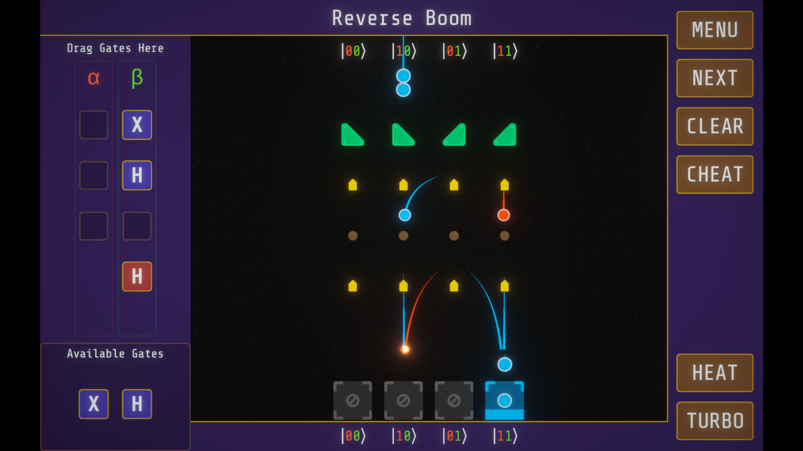

# Superposition Arcade

[Play the game online on Itch.io](https://rsoiffer.itch.io/superposition-arcade)

[Watch the video presentation on Youtube](https://youtu.be/slGN_CHQBy4)

Superposition Arcade is a mind-melting puzzle game built on an realistic simulation of quantum circuits. Your goal is simple: balls fall from the top of the screen, and you need to place pegs to bounce them into the right holes. Each row of pegs is a quantum logic gate, so your choices build up a complex quantum circuit. Gain an intuition for how all the gates work, solve levels based on real quantum circuit identities, and try to find the smallest circuits to solve real-world quantum computing problems!

How to play:
- Drag gates from the box in the lower-left to the board on the left
- Use the gates to bounce all the balls into the matching holes
- Press the Turbo button to speed up the game once you have a solution
- Mouse over a peg to see arrows showing where it sends the balls

## Installing

You can play [online on Itch.io](https://rsoiffer.itch.io/superposition-arcade).

To build the project from source, do the following:
- Install [Unity 2022.3.10f1](https://unity.com/releases/editor/archive)
- Clone this repository
- Open the project in Unity
- Play the game in the Unity Editor, or follow [the guide here](https://docs.unity3d.com/Manual/webgl-building.html) to export a build for web

## Technical Details

Superposition Arcade is built in the Unity game engine. Superposition Arcade does not use any external code libraries.

The quantum circuits in Superposition Arcade are simulated with a simple custom quantum simulator, mostly implemented in the `Assets/Scripts/QData.cs` file. They include a variety of unitary gates, as well as some non-unitary gates, including measurement and noise. The game currently does not support changing the circuit based on the result of measurements, as this would be complex to build into the UI.

## Credits

All the code in this repository is my original work, as are the UI, background, and VFX.

Superposition Arcade uses a number of third-party images and sounds. Many thanks to the wonderful people who made their art available for free.
- Most of the images and sounds are from [kenney.nl](https://kenney.nl/).
- The music is from [Juhani on OpenGameArt](https://opengameart.org/content/5-chiptunes-action).
- The font is from [Carrois on Google Fonts](https://fonts.google.com/specimen/Share+Tech+Mono).

These assets were all published under CC0 or similar licenses, which permit republishing them under the MIT license as I'm doing here.
